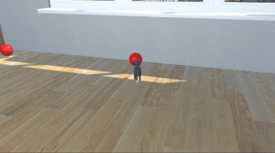
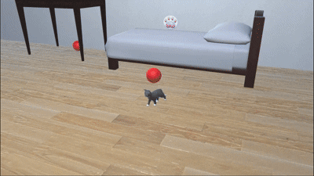
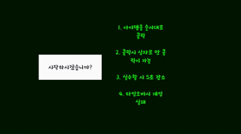

# PuzzleCat

## 📌 Overview
3D 퍼즐 어드벤쳐 게임.  
레이저 퍼즐 미니게임의 로직과 데이터 저장 기능을 담당하여 진행한 짧은 팀 프로젝트입니다.

- **개발 기간:** 2025.08.14 - 2025.08.22
- **개발 인원:** 총 5명 (개발 5)  
- **플랫폼:** PC
- **엔진:** Unity 2022.3.17f1
- **다운로드 링크:** [링크](https://drive.usercontent.google.com/download?id=10aD5AhFeXklBuu-DQd-2jfgLu0N2GgdI&export=download&authuser=0)

---

## 📸 스크린샷 및 영상

---

## 🧑‍💻 담당 업무 (My Role)
### 레이저 퍼즐
- 레이저 퍼즐 로직 구현

  
  
- 퍼즐에 사용되는 각종 오브젝트 구현
  

### 데이터 저장 및 불러오기
- 플레이어 및 퍼즐 클리어 정보를 json으로 변환하여 저장

---

## 🛠 Tech Stack
**Language:** C#  
**Engine:** Unity  
**Tools:** Git, GitHub

---

## 🔍 주요 구현 기능 (Key Features)

### 1) 레이저 퍼즐 로직 및 기능
- 레이저 상호작용을 위한 정보를 담은 구조체 구현([LaserHitInfo, LaserRaycastInfo](https://github.com/UserJin/PuzzleCat/blob/main/Scripts/Puzzle/Laser_Puzzle/Common/Constants.cs))
- 레이저 및 플레이어 입력에 의한 상호작용을 구현하기 위한 인터페이스([ILaserInteractable](https://github.com/UserJin/PuzzleCat/blob/main/Scripts/Puzzle/Laser_Puzzle/Interface/ILaserInteractable.cs), [IInteractable](https://github.com/UserJin/PuzzleCat/blob/main/Scripts/Puzzle/Laser_Puzzle/Interface/IInteractable.cs))
- [LaserPuzzleManager](https://github.com/UserJin/PuzzleCat/blob/main/Scripts/Puzzle/Laser_Puzzle/Managers/LaserPuzzleManager.cs)를 통해 해당 퍼즐 스테이지의 진행을 관리
- 레이저 발사 기능을 Raycast와 LineRenderer를 통해서 구현([LaserRaycaster](https://github.com/UserJin/PuzzleCat/blob/main/Scripts/Puzzle/Laser_Puzzle/Objects/LaserRaycaster.cs))

### 2) 데이터 저장 및 불러오기
- [DataManger](https://github.com/UserJin/PuzzleCat/blob/main/Scripts/Manager/DataManager.cs)를 통해 플레이어의 위치, 회전, 각 퍼즐의 클리어 정보를 저장

---

## 📌 트러블 슈팅 (Trouble Shooting)

### 센서 과연산 문제

- 문제 정의: 특정 상황에서 게임이 거의 멈춰서 작동이 되지 않는 문제가 발생함
- 사실 수집: 원인을 찾기 위해 해당 퍼즐의 일부 요소를 비활성화하여 문제가 발생하는 부분을 탐색함, 이후 센서와 반사판이 존재하는 상황에서 문제가 발생하는 것을 확인
- 원인 추론: 센서는 센서에 레이저가 감지되면 장애물 오브젝트를 이동시키고 그에 따른 레이저를 다시 계산함 → 그 결과 센서가 감지하던 레이저도 다시 계산하고 감지하면서 무한 루프에 빠지는 것으로 추정
- 조치: 센서의 작동 방식을 레이저가 한 번이라도 감지되면 활성화 상태를 유지하는 것으로 수정함
- 결과: 정상적으로 작동되는 것을 확인

### 반사판 스택 오버플로우

- 문제 정의: 특정 상황에서 스택 오버플로우가 발생
- 사실 수집: 해당 문제는 두 레이저가 서로 반대에서 2개 이상의 같은 반사판에 레이저를 발사하게 되면 발생하는 것을 확인
- 원인 추론: 반사판은 레이저가 감지되면 해당 레이저 정보를 리스트에 등록하고 현재 발사하는 레이저를 모두 지우고 리스트의 레이저 정보를 바탕으로 다시 생성하는 로직임 → 레이저가 한개일 때는 문제가 없으나, 2개가 반대방향으로 발사하면 서로 레이저 정보 등록과 생성을 반복하게 되면서 발생한 것으로 추정
- 조치: 레이저 정보 최대 등록 횟수를 지정
- 결과: 스택 오버플로우가 발생하지 않는 것을 확인

    

### 레이저 계산 작동 기준 오류

- 문제 정의: 오브젝트의 위치나 회전을 변경한 이후 레이저가 이전의 정보를 기준으로 계산되는 문제가 발생
- 사실 수집: 브레이크 포인트를 걸었을 때, 회전을 변경하는 부분이 수행되었으나 실제 값은 변하지 않은 것을 확인
- 원인 추론: 레이저의 계산과 실제 트랜스폼의 변환 시점이 달라서 발생한 것으로 추론
- 조치: Physics.SyncTransforms()을 사용 → 잘 작동하지만 부하가 크다는 말을 듣고 일단 보류
코루틴을 통해 0.02초 후에 계산하도록 수정
- 결과: 육안으로 레이저가 사라지는 것이 보이지 않게 잘 작동하는 것을 확인
